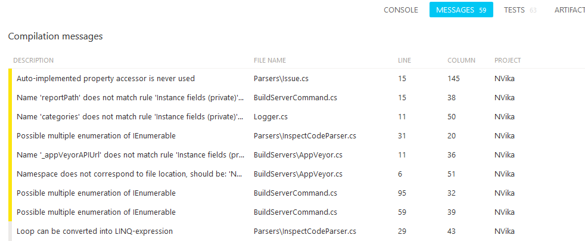

#  vika

Visual Interpreter of Kooky Analysis.
Also means 'bug' in Finnish.

 
 
 
 
 

## What it is
Right now it's just a tiny tool which parse analysis reports and send messages to the build server, or in console if it's not executed on a build server.

You can use it like this: `NVika parsereport "inspectcodereport.xml"`

It is possible to process several reports at the same time: `NVika parsereport report1.xml report2.xml`

### additional params:
 - `--debug`: active the debug category on logger, useful for debugging
 - `--includesource`: include the report source name in messages

### exit codes:
 - 0: OK
 - 1: unknown error
 - 2: report not found
 - 3: exception during report loading
 - 4: no parser found for the current report
 - 5: issue(s) with error severity was found

## Analysis tools
### Supported
 - [InspectCode](https://chocolatey.org/packages/resharper-clt): example of usage `inspectcode /o="inspectcodereport.xml" "Vika.sln"`
 - Analyzers producing [SARIF](http://sarifweb.azurewebsites.net) format, like Roslyn analyzers: for those you need to add an `ErrorLog` node in your `csproj` containing the path of the report, or an `/errorlog:<reportPath>` switch for `csc`; See [NVika.csproj](https://github.com/laedit/vika/blob/master/src/NVika/NVika.csproj)
 - [FxCop](https://msdn.microsoft.com/en-us/library/bb429476(v=vs.80).aspx): example of usage `fxcopcmd /file:NVika.dll /out:FxCopResults.xml`. Or activate Code Analysis in the corresponding tab of your project properties in Visual Studio.
 - [Mono.Gendarme](http://www.mono-project.com/docs/tools+libraries/tools/gendarme/): example of usafe `gendarme --xml GendarmeReport.xml "\GendarmeTest.exe"`

### To come
 - [StyleCop](https://github.com/laedit/vika/issues/7)
 - NDepend?
 - DupFinder (if someone wants it reaaaally bad)
 - [CPD](https://github.com/laedit/vika/issues/27)
 - [CPPCheck](https://github.com/laedit/vika/issues/26)
 
## Build servers
### Supported
  - [AppVeyor](http://appveyor.com)

  
### To come
 - [TeamCity](https://github.com/laedit/vika/issues/4)?
 - [ContinuaCI](https://github.com/laedit/vika/issues/3)?
 - [MyGet](https://github.com/laedit/vika/issues/5)?

I really wondering if there is any value to supporting these three, because there doesn't support to add build message like AppVeyor but only log message.
And they support custom HTML report, so an xslt transformation is enough.

## What it will be
A website will be added for displaying a nice and shiny aggregated report from all source to a dedicated page for each GitHub project.

There also will be a solution to upload a temporary report stored for a week.

And the client may push reports through the website public API.

## Contributing
All contributions are welcome, please read our [contributing guide](CONTRIBUTING.md).

## Attribution
Icon: [Report](https://thenounproject.com/term/report/84881/) designed by [Nataliia Lytvyn](https://thenounproject.com/natashenkalitvin/) from [The Noun Project](https://thenounproject.com/).
